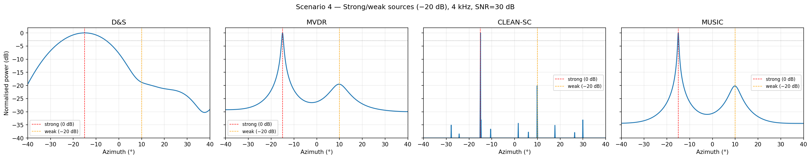
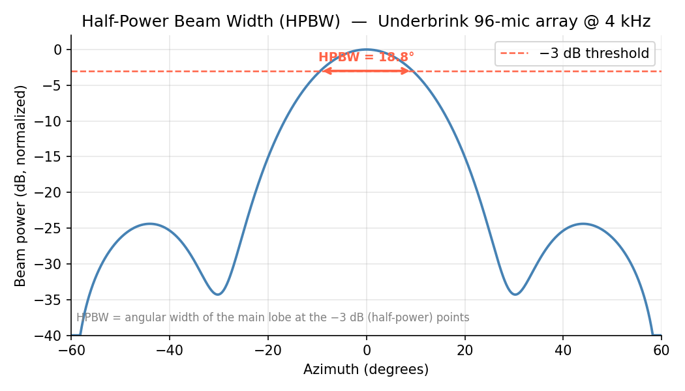
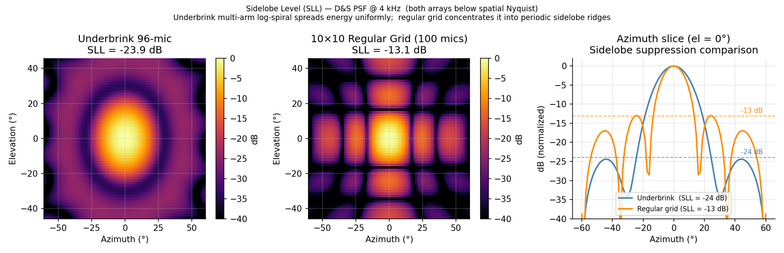
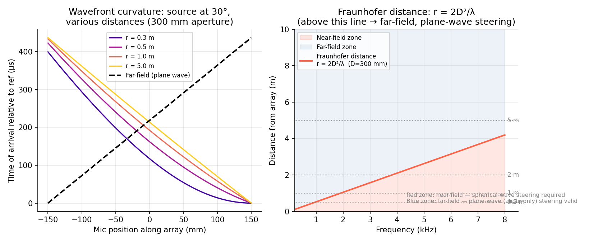
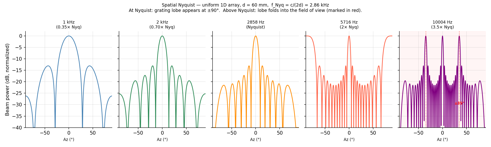
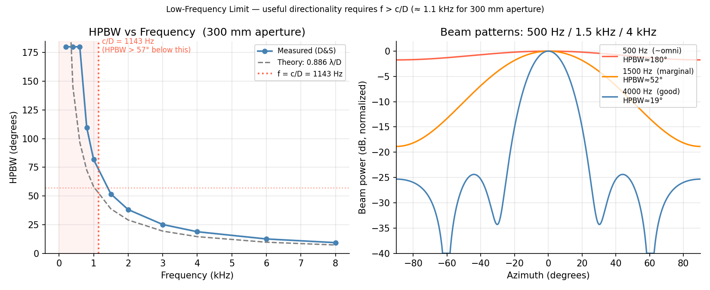
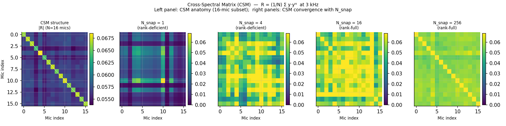
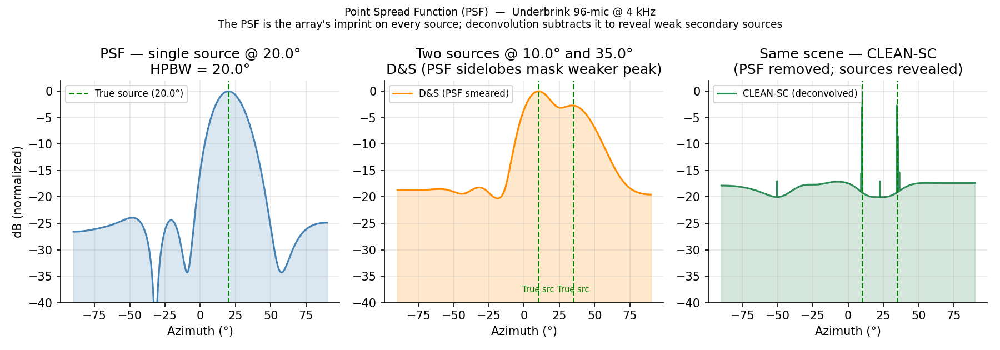
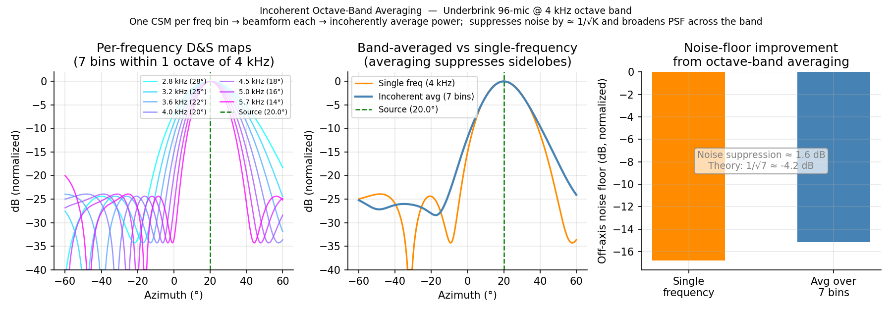

# Acoustic-Camera
The design and implementation of a low-cost, high-performance, acoustic camera

**WIP**

An Acoustic Camera computes a power map of the sound scene that exists within a video camera's field of view and overlays it onto the video in real time.
Capturing, visualizing, and tracking the position of sound sources is useful in a variety of different use cases, including the detection and localization of sources of vibration, gas leaks, electrical breakdown, etc. 
Acoustic Cameras can also serve as a useful prosthetic device for people who have lost hearing in one ear and can no longer localize sound sources.

See an example of a commercial product here [Fluke](https://youtu.be/UPVcwDzhBZ8) and a low-cost consumer product here [Fotric](https://youtu.be/MBhJoPzHv2Y)

## Technical Background

### How Microphone Arrays Localize Sound Sources

The mic array captures the sound field simultaneously at all microphones. A **steering matrix** encodes the expected inter-mic phase pattern for each candidate direction (az, el). A beamformer correlates the received signals against each steering vector and assigns a power value to each grid cell, producing an **energy map** that is overlaid on the video frame.

The key parameters are: **aperture** (sets beam width — larger = sharper), **mic spacing** (sets the spatial Nyquist ceiling; closer = higher frequency limit), and **snapshot count** (sets CSM estimation quality; more = lower noise floor).

### Selected Beamforming Algorithm Families

| Family | Algorithms | Characteristic |
|---|---|---|
| **Delay-and-Sum** | D&S (time or freq domain), Differential, Functional Beamforming | Simple; robust; wide beam; sidelobes mask weak sources |
| **Adaptive / data-dependent** | MVDR (Capon), LCMV, GSC, Frost | Null interferers; sensitive to CSM quality and steering errors |
| **Deconvolution** | CLEAN-SC, CLEAN-PSF, DAMAS, DAMAS2, CMF, COMET2 | Remove PSF artifacts iteratively; reveal secondary sources |
| **Subspace** | MUSIC, Root-MUSIC, ESPRIT, CSSM, TR-MUSIC | Decompose CSM into signal + noise subspaces; super-resolution; require source count estimate |
| **Sparse / Bayesian** | SBL, Atomic Norm Minimization | Gridless; auto-estimates source count; expensive |
| **Spherical-harmonic** | PWD, CroPaC | For spherical arrays; Ambisonics / HOA domain |
| **ML-based** | CNN/CRNN DoA, Transformer (SELD-Conformer), PILOT, Deep MUSIC, NN-MVDR | Learned models; top DCASE benchmarks; need training data matched to array geometry |

In the initial phases of this project, I will explore representative algorithms from each of the first for families -- i.e., D&S, MVDR, CLEAN, and MUSIC.

**Figure:** Example power vs. azimuth plots for a strong and a weak sound source for different algorithms

### Key Concepts in Beamforming

- **Half-Power Bandwidth (HPBW)**: characterizes the angular width of the main lobe of the beam pattern (typically at the −3 dB points)


**Figure:** Beam pattern with -3 dB crossing points annotated

- **Sidelobe Level (SLL)**: metric that measures the power of the sidelobes relative to the main‑lobe peak, usually expressed in decibels (e.g., "20 dB below the main lobe")


**Figure:** 2D PSF with azimuth slice for Underbrink vs. Regular Grid

- **Far-Field vs. Near-Field**: far-field (beyond Fraunhofer distance — r > 2D²/λ) assumes plane waves and requires only angle steering; near-field requires a spherical-wave model and adds range estimation


**Figure:** Left: wavefront curvature at different distances; Right: Frauenhofer boundary vs. frequency

- **Spatial Nyquist**: upper frequency limit set by mic spacing: f_max = c / (2 × d_min); at frequencies above this, grating lobes appear


**Figure:** 1D PSF at five frequencies spanning sub-Nyquist to 3.5x Nyquist

- **Low-frequency Limit**: usable directionality requires roughly f > c / D (aperture-limited); below this HPBW exceeds ~57° and the array is near-omnidirectional


**Figure:** HPBW vs. frequency (measured and theoretic) and three beam patterns

- **Cross-Spectral Matrix (CSM)**: frequency-domain matrix of cross-powers between every mic pair; the universal input to all adaptive and subspace beamformers


**Figure:** Example CSMs

- **Point Spread Function (PSF)**: how the array smears a true point source; deconvolution methods subtract it out


**Figure:** Single-source PSF, two-source D&S (smeared) and CLEAN-SC (resolved)

- **Incoherent Octave-band Averaging**: commercial cameras compute one CSM per frequency bin, beamform each, then average power across an octave band; suppresses noise by √K and produces a band-averaged PSF


**Figure:** Per-bin maps, band average, noise-floor bar chart

See [BACKGROUND.md](./BACKGROUND.md) for full algorithm descriptions and references.

## Microphone Array Configurations

Array geometry controls two things: **beam width** (set by aperture; larger = sharper) and **maximum side-lobe level / MSL** (set by mic distribution; irregular spacing suppresses aliasing artifacts). More mics improve both, but with diminishing returns and linear cost growth.

### 2D patterns

| Pattern | Spacing | Strengths | Weaknesses |
|---|---|---|---|
| **Regular grid** | Uniform | Easy to build; predictable PSF | High, periodic sidelobes; spatial aliasing above Nyquist |
| **Archimedean spiral** | Linear increase with angle | Simple single-arm; even radial coverage | Worse MSL than multi-arm variants |
| **Dougherty log-spiral** | Equal arc-length | Denser center; >10 dB sidelobe suppression at high freq | Single arm — less uniform outer coverage |
| **Arcondoulis** | Adjustable squash | Elliptical or non-circular shapes; tunable center density | More design parameters to optimize |
| **Underbrink** ★ | Multi-arm log-spiral | Best all-around: high resolution + good MSL over wide area; circular symmetry | Patented (US 6,089,671); more complex layout |
| **Brüel & Kjær spiral** | Non-uniform along spokes | Easily disassembled; two concentric hoops | Proprietary geometry |

★ Underbrink is the recommended pattern for this project (see Phase 1 findings). Literature confirms it outperforms other patterns in both resolution and MSL across tested frequencies.

In the initial phases of this project, I will use a 2D microphone array. In later phases a 3D array might be used.

### 3D patterns

| Pattern | Coverage | Framework | Notes |
|---|---|---|---|
| **Spherical** | Full 4π sr | Higher-Order Ambisonics (HOA) | Order N needs (N+1)² mics; order 7 = 64 mics; radius sets freq ceiling |
| **Cylindrical** | 360° az; limited el | Cylindrical Harmonics | Good for horizontal-plane localization in tall spaces |
| **Tetrahedral / Platonic solid** | 3D DoA | First-order Ambisonics (4 mics) up to HOA | Smallest 3D array; Zylia ZM-1 (19 mics) = 3rd-order |
| **Nested / concentric spheres** | Full 4π sr | Multi-shell HOA | Inner shell = high freq; outer shell = low freq; enables range estimation |

See [MIC_ARRAYS.md](./MIC_ARRAYS.md) for full details.

## Design Trade-offs

### Core Tensions

| Parameter | Larger/More | Smaller/Fewer | Sweet spot |
|---|---|---|---|
| **Aperture** | Narrower beam, better low-freq | Portable, cheaper, closer far-field | **300 mm** (8°@8kHz, 66°@1kHz) |
| **Mic count** | Lower sidelobes, better SNR | Less compute and cost | **96 mics** (47% packing at 300 mm) |
| **Mic spacing** | Better directionality at low freq | Aliasing-free to higher freq | **21 mm min** (Nyquist at 8 kHz) |
| **Density** | Better high-freq detail | Lower cost | 96 mics at ~27 mm avg spacing |

### Resolution vs. Aperture (HPBW ≈ 58° × λ/D)

| Aperture | @ 1 kHz | @ 4 kHz | @ 8 kHz |
|---|---|---|---|
| 500 mm | ~40° | ~10° | ~5° |
| **300 mm** | **~66°** | **~17°** | **~8°** |
| 200 mm | ~100° | ~25° | ~12° |

5° resolution at 1 kHz requires D ≈ 4 m, which is impractical. Deconvolution algorithms (e.g.,
CLEAN-SC, Functional BF) can recover some resolution beyond the physical aperture limit but
cannot overcome the hard floor.

### Array Pattern: Underbrink multi-arm log-spiral (chosen pattern)

Outperforms concentric rings, cross arms, and simple spirals on both sidelobe level and spatial
aliasing. The **gfai Mikado** commercial product uses exactly 96 mics in this pattern. Logarithmic
radial spacing naturally covers multiple spatial scales, which is well-suited for the 200 Hz–8 kHz
target.
For this project I've selected **8 arms × 12 mics**. I will simulate 6 × 16 as alternative in Phase 1.

For full details, see: [TRADEOFFS](./TRADEOFFS.md)

## System Requirements

| Parameter | Value | Notes |
|---|---|---|
| Min Distance | ~0.5 m | Far-field criterion r > 2D²/λ; 2×0.3²/0.343 ≈ 0.5 m for 300 mm array at 1 kHz |
| Max Distance | ~10 m | Practical limit for compact array at 200 Hz |
| Resolution | ~8° @ 8 kHz, ~17° @ 4 kHz, ~66° @ 1 kHz | Scales as λ/D; HPBW ≈ 58° × λ/D for 300 mm aperture |
| FOV | ±45° H, ±30° V | Matched to co-located video camera field of view |
| Mic Array Diameter | ~300 mm | 96 mics in Underbrink spiral, ~21 mm min spacing (Nyquist at 8 kHz) |
| Frequency Range | 200 Hz – 8 kHz | Broadband; mic spacing ≤21 mm avoids spatial aliasing at 8 kHz |
| Environment | General-purpose | Indoor/outdoor, low-to-moderate reverberation, single/multiple sources |

## Acoustic Camera Products Overview

A number of existing commercial products were examined to get a sense of their specs, features, and costs.

| Vendor | Product | Mics | Aperture | Freq range | Interface | Notes |
|---|---|---|---|---|---|---|
| miniDSP | UMA-16 v2 | 16 (4×4 URA) | 42×42 mm | 8–48 kHz SR | USB | Phase 3 hardware; XMOS Xcore200 PDM→PCM |
| Convergence Instruments | ACAM-64 | 64 (32×32) | ~187×182 mm | 20 Hz–8 kHz | USB | $2,100; open protocol; 16 kHz audio |
| Sorama | CAM64 | 64 MEMS PDM | 160×160 mm | 1.2–15 kHz (FF) | PoE | Pyramid form factor with handle |
| Sorama | CAM1K | 1024 MEMS | 640×640 mm | 300 Hz–15 kHz (FF) | PoE | Integrated HD camera; 5.5 kg |
| gfai Tech | Mikado | 96 MEMS | hexagon | — | — | Also Ring32/48/72 and large wind-tunnel arrays |
| Head acoustics | Visor VMA V | 60 or 120 MEMS | 0.3 m or 1 m disk | — | — | Depth camera at center; paired/irregular spacing |
| mh Acoustics | Eigenmike em32/em64 | 32 or 64 | spherical | 20 Hz–20 kHz | USB/Dante | HOA reference platform; up to 7th-order Ambisonics |
| Brüel & Kjær | various | — | spherical/wheel/grid | — | — | Research-grade; many geometries |
| Clockworks SP | A²B array | 8 | 100 mm ring | — | A²B bus | Infineon IM68D130 PDM mics; twisted-pair daisy-chain |
| introlab | 16SoundsUSB | 8 or 16 | configurable | 8–96 kHz SR | USB | Open hardware; XMOS xCORE-200; electret or MEMS |

Key observations from the survey:
- **64–96 mics** is the commercial sweet spot for handheld far-field use (1-8 kHz, ~0.16-0.64 m aperture)
- **USB** dominates for portable/desktop use; **PoE** for fixed installations; **A²B/Dante** for multi-node
- **PDM MEMS mics** are standard; electret arrays appear only in large wind-tunnel configurations
- **Integrated video camera** is universal in commercial products and is always co-located at array center
- **Near-field acoustic holography** (25 Hz) requires much closer source distances and a separate processing path from far-field beamforming

See [PRODUCTS.md](./PRODUCTS.md) for full details.

## Beamforming Projects and Libraries

A number of open-source beamforming projects and software packages were also studied to get an idea of what can practically be accomplished in such a project.

| Project | Scale | Interface | Notable technique |
|---|---|---|---|
| Ben Wang (2023) | 192-mic MEMS, 24 radial arms, exponential spacing | FPGA → GbE → GPU host | GPU-fused cross-correlation calibration; PyTorch gradient descent for mic positions + speed of sound |
| Sonicam / CMU ECE (2020) | 96-mic, 6× 4×4 MEMS panels | FPGA → Ethernet | TDK InvenSense mics; large-format panel array |
| Kickstarter handheld (2018) | 64-mic, 3 concentric rings | ARM Cortex-A53, Linux | Battery-powered; 7" touchscreen; 10–24 kHz; 100 fps acoustic |
| 1024-pixel sound camera (2016) | 32×32 MEMS (4× 8×8 tiles) | — | Early large-format MEMS grid demo |

Key takeaways:
- **FPGA → GbE → GPU** is the established pattern for large arrays (96+ mics) — offloads PDM decimation and keeps the host pipeline simple
- **Calibration via cross-correlation** (Ben Wang's approach) is practical at scale: GPU-fused FFT pairs + gradient descent converges in seconds and recovers both mic positions and speed of sound simultaneously
- **Concentric-ring and spiral geometries** appear in handheld products; rectangular grids appear in panel/tile designs
- **Standalone operation** (ARM + touchscreen + battery) is achievable at 64 mics; larger arrays require tethered compute

**acoular** is a Python open-source beamforming framework that includes a reference 64-mic demo.
I'm using this package in some of this project's experiments.
Matlab has a lot of support for beamforming, but I'm sticking with open-source software in this project,
so I haven't really looked at what it has to offer.

See [PROJECTS.md](./PROJECTS.md) for full details.

## Phase 1 Simulation Findings

Full results and methodology are in: [PHASE1](./PHASE1.md)

### Recommended Array Configuration

**Underbrink H=12×8, α=22°** — 96 mics, 300 mm aperture, 12.9 mm min spacing

- Best side-lobe suppression of all patterns tested: -24.4 dB @ 4 kHz, -18.9 dB @ 8 kHz
- Alias-free to ~13 kHz (target ceiling: 8 kHz, 1.7× margin)
- Perfect circular symmetry; azimuth and elevation HPBW are identical at all frequencies

Alternative: H=8×12, α=35° (-14.4 dB MSL, simpler layout, more uniform spacing, which is good if PCB routing is constrained)

### Beamwidth vs Frequency

| Frequency | HPBW | Practical meaning |
|---|---|---|
| 200–500 Hz | > 180° | Omnidirectional -- no spatial selectivity |
| 1 kHz | ~82° | Barely directional; cannot resolve sources within ~80° |
| 2 kHz | ~37° | Minimum frequency for useful imaging |
| 4 kHz | ~19° | Clear maps; commercial acoustic cameras primarily operate here |
| 8 kHz | ~9° | High-resolution; closely-spaced sources resolvable |

### Algorithm Selection

| Use case | Recommended |
|---|---|
| Real-time display, single dominant source | CLEAN-SC |
| Multiple sources or weak source detection | MVDR |
| Closely-spaced sources, source count known | MUSIC |
| Lowest latency / embedded compute | D&S |
| Near-field range + angle estimation | Focused D&S or MVDR/MUSIC with NF steering |

Recommended snapshot count: **N_SNAP = 256** (5.3 ms, 188 fps). All algorithms converge at N_SNAP = 16
(0.3 ms); 256 provides 16× margin while remaining below the ~10 ms perceptual latency threshold.

### Where This System Works Well

- **Mechanical/industrial source hunting at 2-8 kHz**: the primary sweet spot. Fan noise, gear mesh,
  bearing defect harmonics, structural resonances. MVDR/MUSIC resolve sources separated by 10-15° that
  D&S cannot
- **Multi-source scenes**: MVDR and MUSIC maintain 100% resolution reliability down to DRR = -3 dB
  (reverb exceeding direct power). MUSIC handles sub-HPBW separations when source count is known
- **Typical indoor rooms and labs (DRR ≥ 10 dB)**: 96 channels provide ~20 dB array gain; DoA error
  at typical office DRR is indistinguishable from anechoic (~0.035°). Mild reverberation suppression is essentially free
- **Near-field operation at 0.5-3 m**: spherical-wave steering recovers range to within ~10 cm and
  azimuth within grid quantization. Sub-centimeter range error at 1.5 m in simulation
- **Outdoors or in treated spaces**: consistent strong performance; no special mitigation needed

### Where This System is NOT Well-Suited

- **Below 1 kHz**: the array is omnidirectional at 200–500 Hz and barely directional at 1 kHz
  A dedicated low-frequency array would need ~1.7 m aperture for 10° resolution at 1 kHz
- **Highly reverberant industrial environments (DRR < 3 dB)**: concrete rooms, large metal enclosures,
  live rooms. Spatial pre-filtering (WPE) is needed before beamforming
- **Same-azimuth, different-range source separation**: range resolution along a single bearing at
  4 kHz / 300 mm aperture is ~1 m. Co-azimutal sources closer than ~1 m merge into a single peak.
  A colocated depth camera is the practical solution
- **Low SNR (< 10 dB) with MUSIC**: overcounting 'n_sources' produces 93-100% false alarm rate below
  10 dB SNR. D&S and MVDR degrade more gracefully; use AIC/MDL model-order selection or conservative
  'n_sources' at low SNR
- **High dynamic range (weak source near a strong source) with D&S or CLEAN-SC**: a -20 dB weak source
  25° from a strong source is reliably detected only by MVDR and MUSIC
- **Sources beyond ~3-4 m**: range estimation degrades sharply beyond the Fraunhofer distance (2.1 m
  at 4 kHz). Far-field azimuth-only mode still works at long range; range information is unavailable

## Phase 2 Smoke Test — ReSpeaker 4-Mic Array

Full results and methodology: [PHASE2](./PHASE2.md)

End-to-end pipeline validation on real hardware: audio capture → beamforming → energy map → video overlay.


Hardware: **ReSpeaker XVF3800 USB 4-Mic Array** (4 mics, 90mm aperture, 16 kHz, driverless USB).
https://www.seeedstudio.com/ReSpeaker-XVF3800-USB-Mic-Array-p-6488.html

### Hardware Findings

- USB device index 12; 6 channels at 16 kHz; 23.9 ms latency
- Channel mapping: ch0 = Conference processed, ch1 = ASR processed, **ch2-5 = Mic 0-3 raw**
- Mic gain imbalance up to ~3.6× across raw channels (Mic 1 consistently lower); motivates calibration

### Pipeline Validation (nb13)

Welch-style CSM from 3 sec ambient recording (~373 blocks at 256-sample blocks, 128-sample hop):

| Algorithm | Peak (°) | Notes |
|---|---|---|
| D&S | 2.7° | Near boresight; consistent with dominant frontal source |
| MVDR | 7.5° | Near boresight |
| CLEAN-SC | 2.7° | Near boresight |

All three agree within 5° -- **PASS**.

Peaks are stable 500-1750 Hz; scatter increases at 2000-2250 Hz as expected near the 2695 Hz spatial Nyquist.

### Calibration (nb14)

Cross-correlation-based gain and phase calibration. Run `notebooks/14_respeaker_calibration.ipynb` while playing a 1 kHz sine tone from boresight at 0.5-1 m to obtain valid calibration. Calibration vector saved to `test/ReSpeaker/cal.npy`.

### Live Script

```bash
python src/acoustic_camera_p2.py                              # D&S, 1000 Hz
python src/acoustic_camera_p2.py --algo music --freq 2000     # MUSIC, 1 source
python src/acoustic_camera_p2.py --algo music --freq 2000 --nsrc 2 --video 4
python src/acoustic_camera_p2.py --algo mvdr --freq 1500 --cal test/ReSpeaker/cal.npy
```

Real-time two-thread pipeline: `sounddevice.InputStream` → sliding CSM → beamform → COLORMAP_INFERNO energy strip overlaid on webcam frame. Strip brightness reflects absolute audio level (running peak reference, ~10 s decay). Peak direction shown as a green vertical line. FPS displayed in overlay.

Algorithms: `ds`, `mvdr`, `clean` (CLEAN-SC), `music`. For MUSIC, `--nsrc` sets the signal subspace dimension (default 1); noise subspace = N − n_src eigenvectors. Use 1500–2000 Hz for meaningful directionality with this 4-mic array.

## Phase 3 Smoke Test — miniDSP UMA-16 v2

Full results and methodology: [PHASE3](./PHASE3.md)

16-mic 4×4 URA pipeline validation: audio capture → 2D beamforming (Az × El) → full-frame overlay.

Hardware: **miniDSP UMA-16 v2** (16 mics, 126 mm × 126 mm aperture, 48 kHz, driverless USB).
https://www.minidsp.com/products/usb-audio-interface/uma-16-microphone-array

### Hardware Findings

- USB device index 12; 16 channels at 48 kHz; Knowles SPH1668LM4H-1 MEMS mics (65.5 dB SNR)
- All 16 USB channels are raw mic data (no processed channels as in Phase 2)
- RMS levels balanced across channels (~5e-5 ambient noise floor)
- Channel ordering: PDM L/R pairs per data line (see [PHASE3](./PHASE3.md) for mapping)

### Live Script

```bash
python src/acoustic_camera_p3.py                                  # D&S, 2000 Hz
python src/acoustic_camera_p3.py --algo mvdr --freq 3000          # MVDR, 3 kHz
python src/acoustic_camera_p3.py --algo music --nsrc 2            # MUSIC, 2 sources
python src/acoustic_camera_p3.py --cal test/UMA16/cal.npy         # with calibration
```

Real-time two-thread pipeline: `sounddevice.InputStream` (16-ch, 48 kHz) → sliding CSM →
2D beamform (azimuth × elevation grid) → COLORMAP_INFERNO full-frame overlay blended onto
webcam video. Green cross-hair marks peak direction (az, el). FPS displayed in overlay.

Algorithms: `ds`, `mvdr`, `clean` (CLEAN-SC), `music`. Spatial Nyquist ~4.1 kHz; operate at
2000-3700 Hz for meaningful 2D directionality. With N=16 mics, MVDR/MUSIC provide measurable
super-resolution benefit over D&S.

### Lessons from the UMA-16 Experiments

* Key Intuition
  - mic arrays figure out locations based on direction of arrival
    * figure out direction of arrival based on the input signal's phase differences at different mics
    * at high frequency, a 10deg shift in angle of arrival results in a large, easily measureable phase difference 
  - phase differences grow with frequency
    * low frequency sound waves are hard to localize
    * at low frequency, the phase shift that results from a 10deg shift in angle of arrival is lost in the noise
  - min spacing of mics defines Spatial Nyquist
    * can't go to higher frequency than this to get better localization

* Rule of Thumb
  - useful directionality requires roughly λ < D, i.e.:
  - f > c / D = 343 / 0.126 ≈ 2.7 kHz for the UMA-16
  - below that frequency, the HPBW exceeds ~57° and degrades fast

|  Freq   │ HPBW │     Character     │
|--------:|-----:|:------------------|
│ 3000 Hz │ 43°  │ Good localization │
│ 2000 Hz │ 73°  │ Marginal          │
│ 1000 Hz │ 116° │ Poor              │
│ 500 Hz  │ 180° │ Fully omni        │

* UMA-16 Usable Frequency Range
  - for the UMA-16, the usable window is roughly 2–4 kHz
    * bounded below by aperture-limited directionality and above by spatial Nyquist aliasing
    * this happens to overlap well with speech consonants and many mechanical tones
      - this is why a 126 mm array is a practical choice for a desktop acoustic camera

## Target Design
Full details: [DESIGN](./DESIGN.md)

### Microphone Array

- **96× Infineon IM69D120** PDM MEMS mics: 69 dBA SNR, ±1 dB sensitivity, ±2° phase match (factory-calibrated)
- **Underbrink multi-arm log-spiral**: 8 arms × 12 mics (simulate 6 × 16 as alternative in Phase 1)
- **~300 mm diameter aperture; ~21 mm minimum mic spacing**: Spatial Nyquist at 8 kHz
- **Custom PCB(s)**: mics share (carefully distributed) PDM clock, paired L/R → 48 DATA + 1 CLK to FPGA

### Interface and Compute

- **Pipeline**: PDM mics → FPGA hub → GbE → Linux host PC with GPU
- **FPGA** handles: PDM clock distribution, per-channel CIC + FIR decimation (3.072 MHz PDM → 48 kHz 24-bit PCM), synchronous sampling, GbE packetization (UDP, with sequence numbers)
- **Data rate**: 96 ch × 48 kHz × 24 b ≈ 110 Mbps — fits within 1 GbE
- **FPGA** candidates: Lattice ECP5 (open-source toolchain) or Xilinx Artix-7 XC7A100T (resource headroom)
- inspired by Ben Wang's 192-mic FPGA design

### Software

- Python and Acoular for beamforming core; GPU acceleration via PyTorch/CuPy
- Algorithm progression: D&S → MVDR → CLEAN-SC → ML
- USB webcam at array center; OpenCV overlay of energy map on video

### GUI (Phase 2/3 — USB-tethered)

Live video overlay · frequency band selector · dynamic range sliders · algorithm selector ·
persistence slider · record/stop · SPL meter · status bar

### GUI (Phase 4b — standalone field use)

Embedded web UI over WiFi (inclusive or) 7" touchscreen · physical record/stop button · battery operation.

## Development Plan
Full details: [PLAN](./PLAN.md)

Each phase delivers a working end-to-end system — never "not yet working" for more than one phase at a time.

| Phase | Hardware | Goal | Status |
|---|---|---|---|
| **1** | None (simulation) | Validate algorithms and array geometry in simulation; generate training datasets | Complete |
| **2** | ReSpeaker XVF3800 (4-mic, 90 mm) | End-to-end pipeline: capture → beamform → overlay; surface real-world issues | Complete |
| **3** | miniDSP UMA-16 v2 (16-mic, 126 mm) | Scale to 16 channels; 2D Az × El beamforming; validate MVDR/MUSIC benefit | In progress |
| **4** | Custom PCB (96-mic, 300 mm, FPGA hub) | Full-performance system meeting all requirements | Not started |
| **5** | Phase 3/4 hardware | ML-based beamformer (PILOT / CRNN); benchmark vs CLEAN-SC | Not started |

**Phase 4 hardware sub-tasks** (can be parallelized): mic array PCB · FPGA hub board (PDM → GbE) · co-located video camera

**Phase 5** requires real data from Phase 3/4 to train and validate ML models

## Implementation Details
Full details: [IMPLEMENTATION](./IMPLEMENTATION.md)

### Hardware

**Mic**: Infineon IM69D120V01XTSA1 PDM MEMS (~$0.76 each at Newark)

**FPGA candidates** (PDM decimation, GbE packetization):

| Device | LUTs | BRAM | Toolchain | Dev board |
|---|---|---|---|---|
| Lattice ECP5-85F | 84K | 3.4 Mb | Yosys/nextpnr (open-source) | OrangeCrab, ULX3S |
| Xilinx Artix-7 XC7A100T | 101K | 4.8 Mb | Vivado; mature IP ecosystem | Arty A7-100T, Nexys A7 |
| Intel Cyclone 10 LP | — | — | Quartus | Cyclone 10 LP Eval Kit |

### Software stack

| Package | Role |
|---|---|
| acoular | Beamforming core (D&S, MVDR, CLEAN-SC, array geometry) |
| pyroomacoustics | Room acoustics simulation, synthetic source data |
| acoupipe | ML training dataset generation |
| sounddevice | Real-time USB audio capture (Phases 2/3) |
| opencv-python | Video capture, overlay, display |
| scipy / numpy | Signal processing, array math |
| matplotlib / seaborn | Plotting and visualization |
| h5py | HDF5 I/O (Acoular data format) |
| jupyterlab | Notebooks (Phase 1 deliverable) |

See also: [FOSS](./FOSS.md) for open-source beamforming software survey; [MICS](./MICS.md) for mic element details.

---

# Notes

* Outstanding Questions
  - what camera/optics are needed to match the mic array's FOV and resolution?
  - ?

* Phase 1
  - Tasks
    * array geometry visualization
    * a D&S beamforming demo
    * Underbrink vs. other patterns comparison
      - H=12x8 has best side-lobe suppression
      - spiral angle matters, a=35deg and a=22deg improve beam pattern a lot
      - beamwidth is set by aperture only
        * at 1kHz and below, the beam width is greater than the FOV, so can't localize
          - is this a problem?
          - where's the knee of the curve when it comes to beam width vs. aperture at lower frequencies?
      - ?

* TODOs
  - match camera and mic array resolution
  - match audio input path dynamic range to ADCs
  - careful layout of audio front-end to ensure low noise
  - get ADCs that share common clock and (if multiple in a package) sample at the same point
  - look at creating add-on arms to increase the aperture to improve resolution at low frequencies


* Advantages of low SNR mic in beamforming applications
  - https://audioxpress.com/article/microphone-array-beamforming-with-optical-mems-microphones
  - a better SNR mic can do better than multiple lesser SNR mics
  - lower SNR mic means more compact array is possible
    * 42mm mic spacing for a BW of  4KHz requires 17dB gain @ 100Hz -> min mic SNR = 65dBA
    * 21mm mic spacing for a BW of  8KHz requires 22dB gain @ 100Hz -> min mic SNR = 70dBA
    *  7mm mic spacing for a BW of 24KHz requires 32dB gain @ 100Hz -> min mic SNR = 80dBA
* I2S PCM MEMS mics comparisons
  - I have, and tested
    * INMP441 (441 NEO447)
    * MSM261S4030H0 (Xiao Sense?)
  - Amazon
    * SPH0645LM4H-B (Knowles?)
    * MSM261S4030H0
  - others
    * InvenSense ICS-52000 -- not I2S, TDM
    * InvenSense ICS-43434
    * InvenSense ICS-43432
* reSpeaker
  - ST MP34DT01TR-M
    * 4x PDM Omni MEMS mics
    * 90mm diameter, 33mm inter-mic spacing
    * SNR: 61 dB
    * Sensitivity: -26 dBFS
    * Overload: 120 dBSPL
    * Max sample-rate: 16 kHz (limited by onboard XMOS firmware, not the mic hardware)
  - micro USB interface, USB 2.0 (UAC1.0)
  - Linux/macOS driverless; Windows requires driver

---

# Docs

* 000405.pdf: On the Design of a MEMS Microphone Array for a Mobile Beamforming Application
  - built a mic array for the back of a smartphone
  - simulated different mic array configurations
  - used a genetic algorithm to optimize the placement of mics on a spiral
  - used XMOS dev board and 16x mics
    * Infineon’s IM69D130 digital MEMS mic
* 000468.pdf: Optimal planar microphone array arrangements [2015]
  - simulated lots of array arrangements for Vogel's Spiral with different H and V values
  - showed Underbrink Spiral is best trade-off between beam width and side-lobe levels
* 0080015889.pdf
  - ?
* 20080015889.pdf: A Deconvolution Approach for the Mapping of Acoustic Sources (DAMAS) Determined from Phased Microphone Arrays [2004]
  - ?
* 2021_12_De+Lucia.pdf: Implementation of a low-cost acoustic camera using arrays of MEMS microphones [2020]
  - ?
* 254.pdf: Comparison of Different Beamforming-based Approaches for Sound Source Separation of Multiple Heavy Equipment at Construction Job Sites
  - ?
* 373.pdf: Acoular Workshop: Accessible and Reproducible Microphone Array Signal Processing with Python
  - history and overview of Acoular
* BeBeC-2016-S4.pdf: A Generic Approach to Synthesize Optimal Array Microphone Arrangements [2016]
  - same material as 000468.pdf
* BeBeC-2022-D06.pdf
  - ?
* BeBeC-2022-S07.pdf
  - ?
* bp2144.pdf
  - ?
* Chakravarthula_Seeing_With_Sound_Long-range_Acoustic_Beamforming_for_Multimodal_Scene_Understanding_CVPR_2023_paper.pdf [2023]
  - ?
* EN-AVT-287-04.pdf: Fundamentals of Acoustic Beamforming [?]
  - ?
* GB2438259A.pdf: Audio recording system utilising a logarithmic spiral array [2006]
  - UK Patent application
  - ?
* IN-Pflug-Krischker-AspectsOfTheUseOfMemsMicrophones-2017.pdf: Aspects of the Use of MEMS Microphones in Phased Array Systems [2017]
  - compared MEMS mics to electrec capsule mics in 2015 and again in 2017
    * while MEMS got better in 2017, they still were worse than electret mics
  - MEMS mic EIN levels were worse than analog electrec in 2017, but cheaper per channel
    * can use more mics and effectively reduce the noise
  - also MEMS mic freq response was not as good in 2017
    * can do digital equalization filters to improve this for MEMS mics
* 'Lecture 4 - Microphone Arrays.pdf'
* mccormack2017parametric.pdf: Parametric Acoustic Camera for Real-Time Sound Capture, Analysis and Tracking [2017]
  - ?
* microphone_array.pdf: Microphone Arrays : A Tutorial [2001]
  - ?
* Mon-1-2-5.pdf
* noise-and-vibration-image-brochure-2024-gfaitech.pdf
  - ?
* p453.pdf: Design and Calibration of a Small Aeroacoustic Beamformer [2010]
  - ?
* p5.pdf: A comparison of popular beamforming arrays [2013]
  - ?
* s13272-019-00383-4.pdf
  - ?
* 'Schumacher - 2022 - Evaluation of microphone array methods for aircraf.pdf'
  - ?
* Sound_Localization_and_Speech_Enhancement_Algorith.pdf
  - ?
* time-domain-beamforming-3d-micarray-doebler-heilmann-meyer-2008-bebec.pdf
  - ?
* TP-2007-345.pdf
  - ?
* Wang_2023_J._Phys. Conf._Ser._2479_012026.pdf: 
Research on multi-sound source localization performance
based on leaf-shaped microphone array [2022]
  - ?
  

